\# 🧪 Laboratory Management System


A desktop Laboratory Management System developed with \*\*C#\*\*, \*\*Windows Forms\*\*, and \*\*SQL Server\*\* using a layered architecture.


\---


\\## 📖 Overview


This project was developed as a university laboratory management system to manage laboratory operations, including patient registration, employee management, laboratory tests, insurance types, reception records, and reporting.


The application follows a layered architecture consisting of \*\*Presentation\*\*, \*\*Business\*\*, \*\*Data Access\*\*, and \*\*Domain Model\*\* layers.


\---


\\# ✨ Features


\- 🔐 User Authentication (Login)

\- 👤 Patient Management

\- 👨‍⚕️ Employee Management

\- 🧪 Laboratory Test Management

\- 📂 Test Category Management

\- 📏 Test Unit Management

\- 📊 Test Range Management

\- 💳 Insurance Type Management

\- 📝 Reception Registration

\- 📄 Reporting Module


\---


\\# 🛠 Technologies


\- C#

\- Windows Forms (.NET Framework)

\- SQL Server

\- ADO.NET

\- Layered Architecture


\---


\\# 📂 Project Structure


```text

Laboratory

│

├── DataAccess

├── DomainModel

├── Framework

└── Laboratory (UI)

```


\---


\\# 📸 Screenshots


\## Login


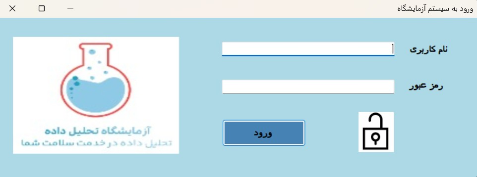


\---


\*\*Main Dashboard\*\*


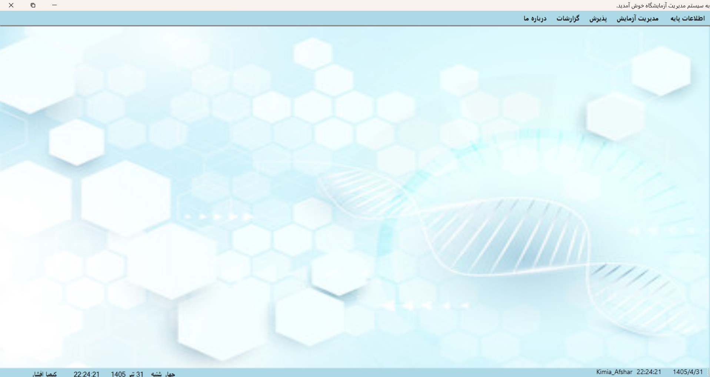


\---


\*\*Patient Management\*\*


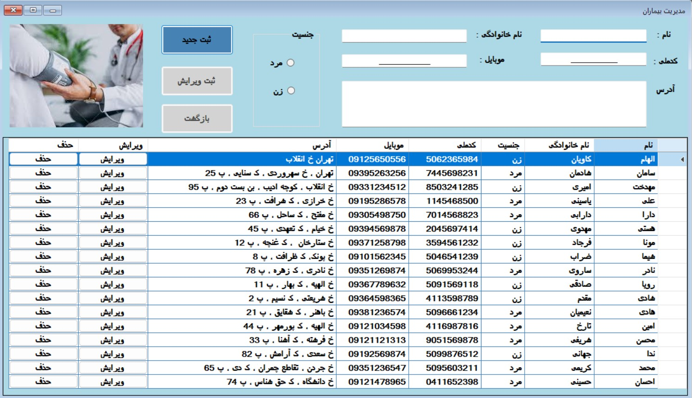


\---


\*\*Employee Management\*\*


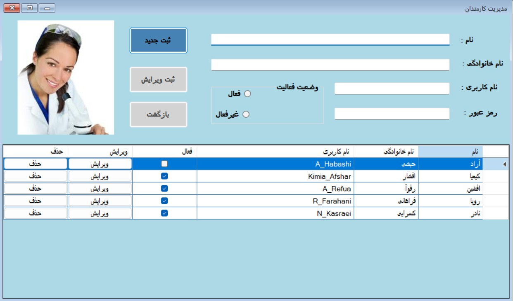


\---


\*\*Reception Management\*\*


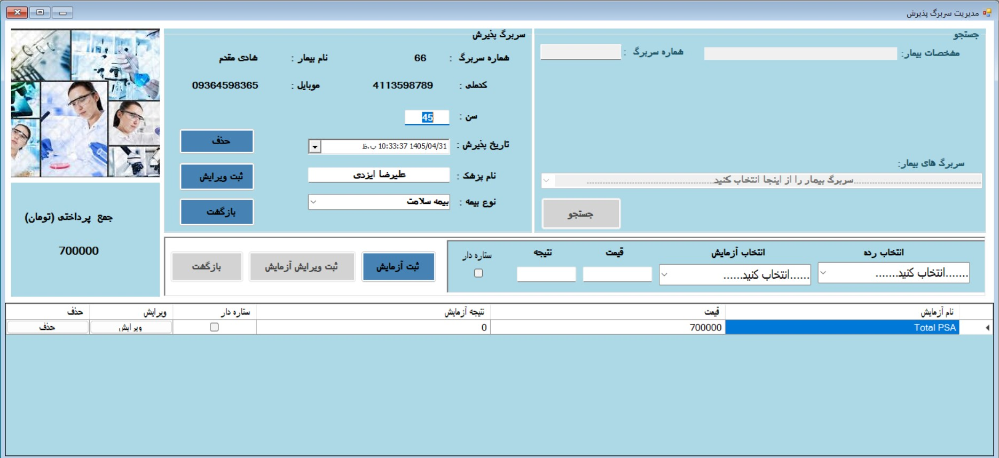


\---


\*\*Reception Registration\*\*


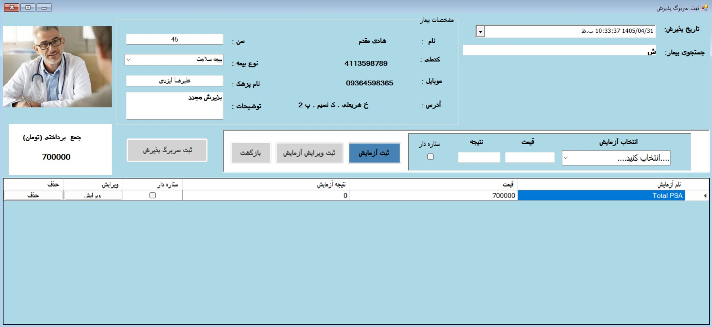


\---


\*\*Test Management\*\*


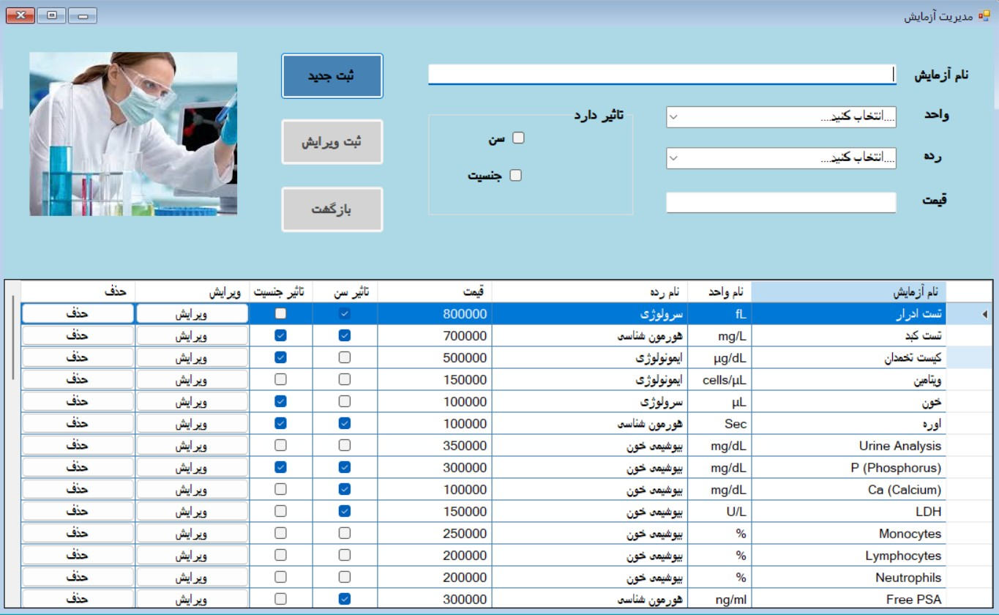


\---


\*\*Test Categories\*\*


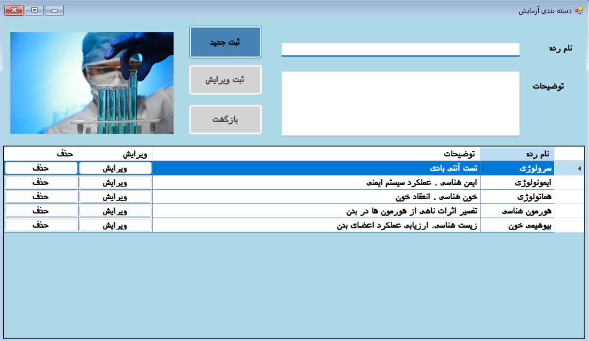


\---


\*\*Test Units\*\*


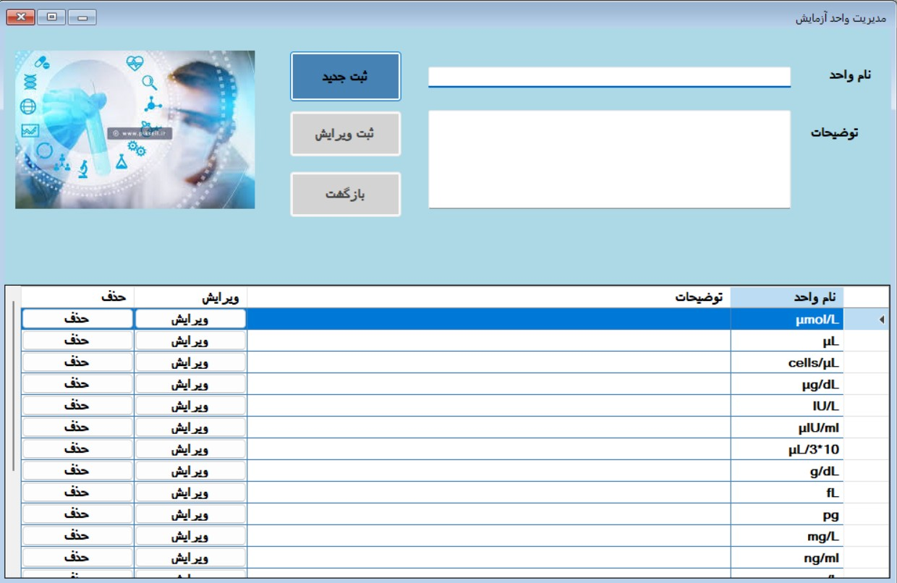


\---


\*\*Test Ranges\*\*


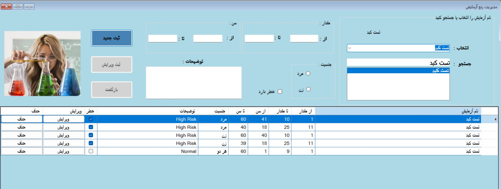


\---


\*\*Insurance Management\*\*


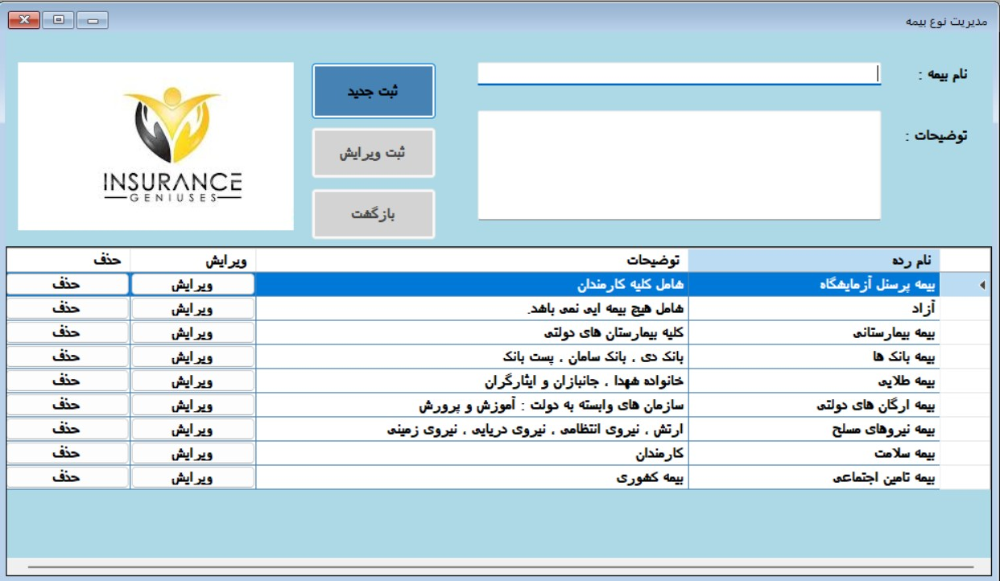


\---


\*\*Reports\*\*


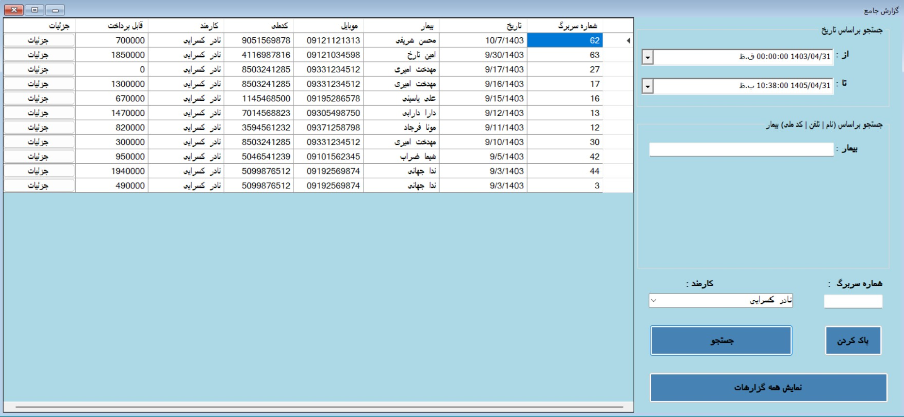


\---


\## 👨‍💻 Author


Developed by \*\*Kimia Afshar\*\*


.NET Developer passionate about building desktop and web applications using C#, SQL Server, and modern software architectures.


\### Connect with me


🐙 GitHub:  

https://github.com/KimiaAfsharIran79

